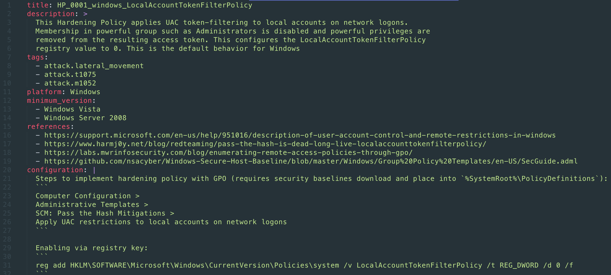
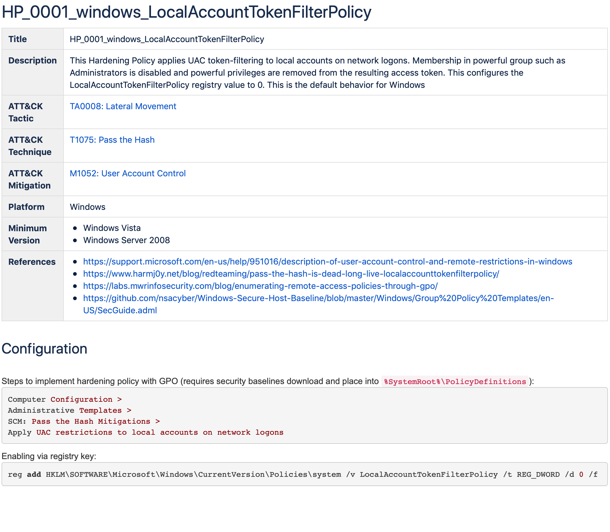
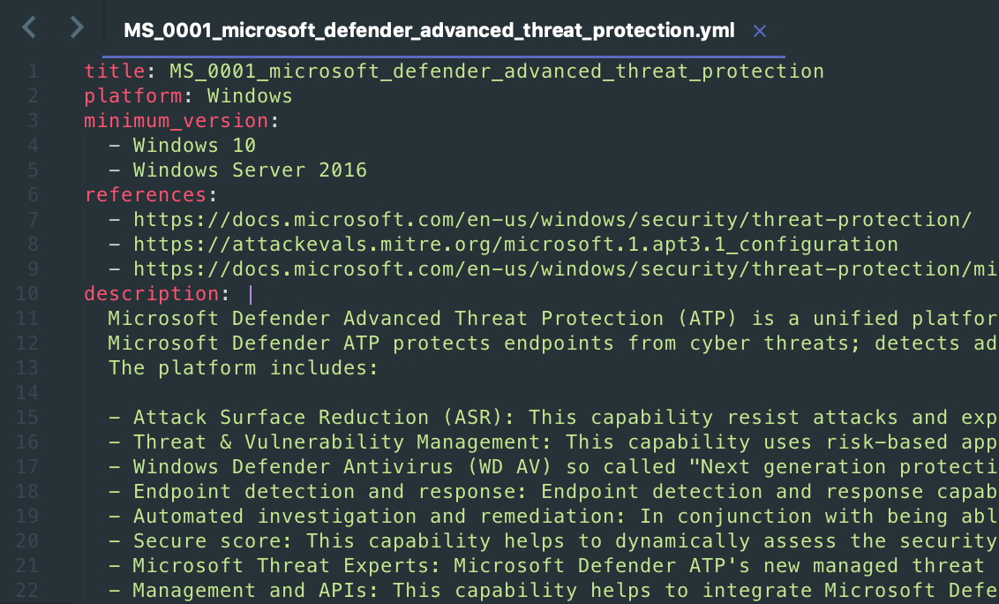
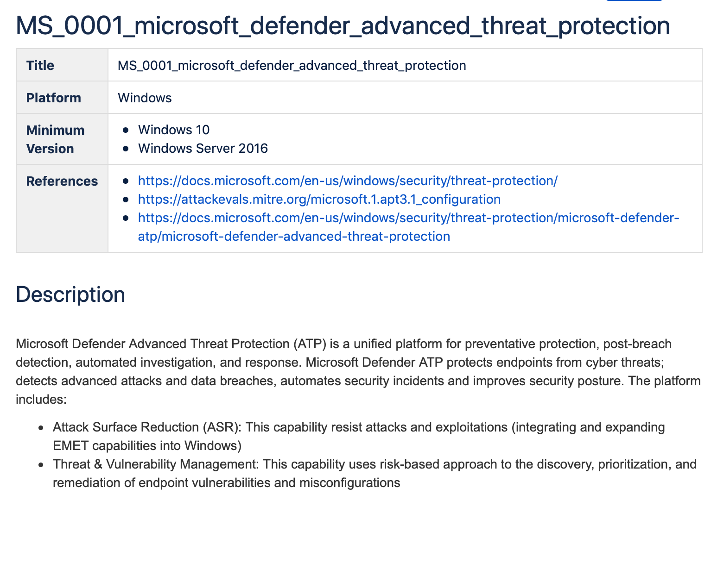
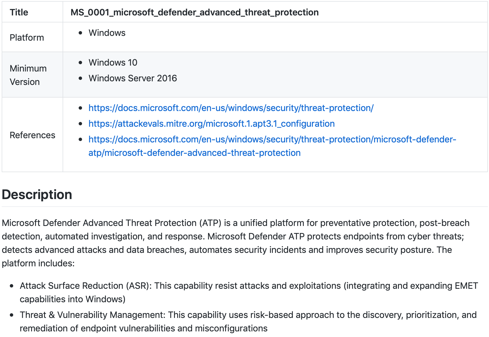
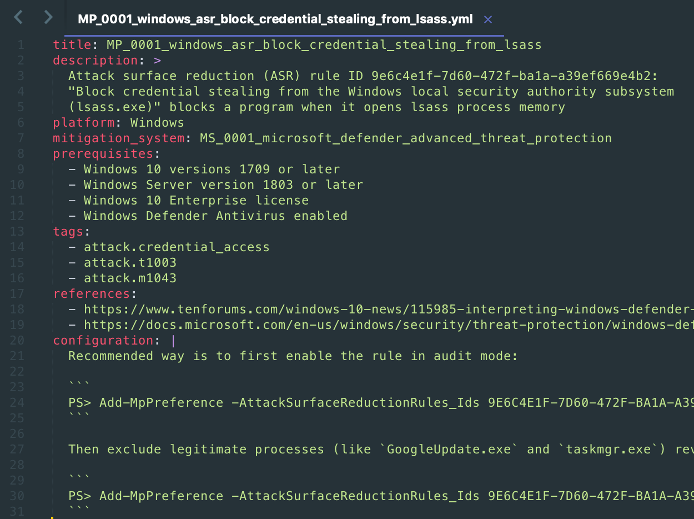
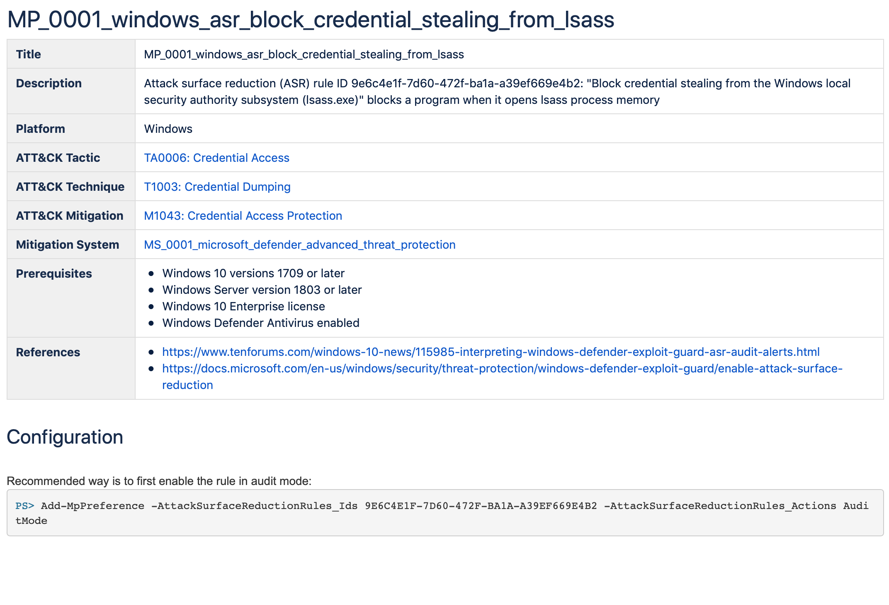
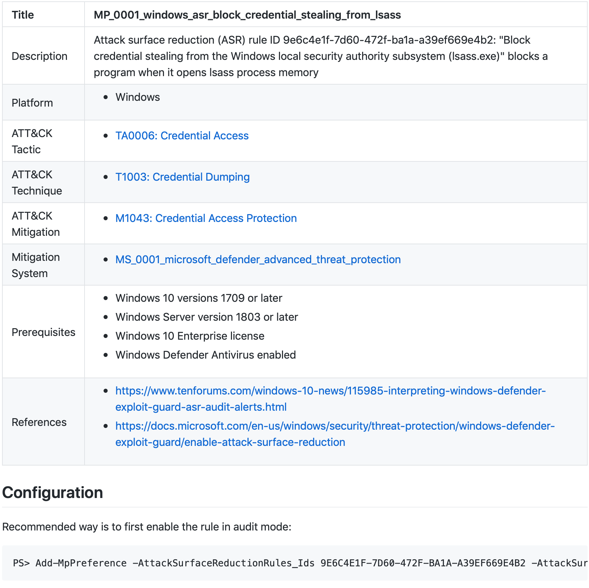

# ATC Mitigation

is a sub-project of [Atomic Threat Coverage](https://github.com/atc-project/atomic-threat-coverage) framework, related to Mitigation techniques of all kinds.


## Description

The project is following "actionable analytics" paradigm, inherited from parent project. We are detailing MITRE [ATT&CK](https://attack.mitre.org/) framework to make it more specific and clear for those who want to operationalize it. 

Entities of the project play role of data source for [Atomic Threat Coverage](https://github.com/atc-project/atomic-threat-coverage) framework, which will pick it up and process, generating markdown and confluence knowledge bases, ATT&CK Navigator profiles, Elasticsearch indexes and [other](https://github.com/atc-project/atomic-threat-coverage#how-it-works) analytics.

<!-- Unfortunately, analytics of this project are not **fully** actionable, providing commands/configurations which could be executed only manually. We believe that one day somebody will develop project with automation abilities for mitigation, just like [Atomic Red Team](https://github.com/redcanaryco/atomic-red-team) done it for Threat Simulation tests. -->

There are the next entities present:

- **Hardening Policies** — description of native OS mechanisms to be configured to mitigate specific Threat
- **Mitigation Systems** — description of systems to be deployed and configured to mitigate specific Threat
- **Mitigation Policies** — specific configurations of Mitigation Systems to mitigate specific Threat

These entities also connected to Detection and Response functions:

- Mitigation Systems provide specific [Data](https://github.com/atc-project/atomic-threat-coverage#data-needed) required for Detection/Hunting and Incident Response
- Mitigation Systems provide ability to execute specific [Actions](https://github.com/atc-project/atomic-threat-coverage#response-actions) required during Incident Response

We are going to highlight these connections to emphasize importance of some Mitigations over others.

### Motivation

Mostly, we are just tired of vendor's marketing materials, magic quadrants, security systems which are not just not working, but making everything worse. From our observation, sadly we have to admit that most of the companies in Information Security area seem to target only the income.  

We are targeting security, as well as most of community projects.  

That's why we would like to show and proof that *some* security systems are highly overestimated, while importance of basics, (i.e. hardening, which is not just cheap, but **free**) is extremely underestimated.

It was hard to do before MITRE [ATT&CK](https://attack.mitre.org/) had been released. Now we have detailed description of threats and can map specific Mitigations to them, showing what **exactly** needs to be done to protect systems against specific threats.  

### Under the hood

Data in the repository:

```
├── hardening_policies/
│   ├── HP_0001_windows_LocalAccountTokenFilterPolicy.yml
│   └── hardeningpolicies.yml.template
├── mitigation_policies/
│   ├── MP_0001_windows_asr_block_credential_stealing_from_lsass.yml
│   └── mitigation_policy.yml.template
└── mitigation_systems/
    ├── MS_0001_microsoft_defender_advanced_threat_protection.yml
    └── mitigation_system.yml.template
```

### Hardening Policies

<details>
  <summary>Hardening Policy yaml (click to expand)</summary>
  
</details>

<details>
  <summary>Automatically created confluence page (click to expand)</summary>
  
</details>

<details>
  <summary>Automatically created markdown page (click to expand)</summary>
  
</details>

<br>

This entity used as a description of specific native OS mechanisms' configurations which could mitigate specific threat with mapping to MITRE [ATT&CK](https://attack.mitre.org/).

### Mitigation Systems

<details>
  <summary>Mitigation System yaml (click to expand)</summary>
  
</details>

<details>
  <summary>Automatically created confluence page (click to expand)</summary>
  
</details>

<details>
  <summary>Automatically created markdown page (click to expand)</summary>
  
</details>

<br>

This entity used as a description of System which can provide threat mitigation abilities via Mitigation Policies (specific configurations).

### Mitigation Policies

<details>
  <summary>Mitigation Policy yaml (click to expand)</summary>
  
</details>

<details>
  <summary>Automatically created confluence page (click to expand)</summary>
  
</details>

<details>
  <summary>Automatically created markdown page (click to expand)</summary>
  
</details>

<br>

This entity used as a description of specific configurations which could be applied on Mitigation System to mitigate specific threat with mapping to MITRE [ATT&CK](https://attack.mitre.org/).

### Other projects in this area

- [CIS benchmarks](https://www.cisecurity.org/cis-benchmarks/) — best description of hardening strategies (for some OSes), but no mapping to MITRE ATT&CK. Once they will implement this mapping, we will integrate their analytics into the project
- [ansible os-hardening](https://github.com/dev-sec/ansible-os-hardening) — great project, but no mapping to MITRE ATT&CK. Once they will implement it, we will integrate them into the project

## Contacts

- Folow us on [Twitter](https://twitter.com/atc_project) for updates
- Join discussions in [Slack](https://join.slack.com/t/atomicthreatcoverage/shared_invite/enQtNTMwNDUyMjY2MTE5LTk1ZTY4NTBhYjFjNjhmN2E3OTMwYzc4MTEyNTVlMTVjMDZmMDg2OWYzMWRhMmViMjM5YmM1MjhkOWFmYjE5MjA) or [Telegram](https://t.me/atomic_threat_coverage) 

## Author

- Daniil Yugoslavskiy, [@yugoslavskiy](https://github.com/yugoslavskiy)

## Contributors

- Would you like to become one? You are very welcome! Use [CONTRIBUTING](https://github.com/atc-project/atomic-threat-coverage/blob/master/CONTRIBUTING.md) guidelines to contribute to the project.

## License

See the [LICENSE](LICENSE) file.
